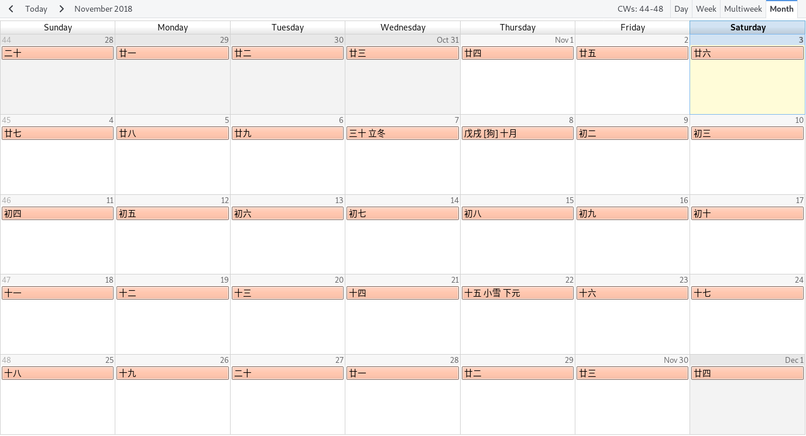

## 農曆、節氣、及傳統節日

iCalendar 是一種常見的日曆交換格式，許多軟體、服務和裝置都支持，如 Google
Calendar, Apple Calendar, Thunderbird/Lightning, iPhone/iPad, Android。



以下連結是從 2018 到 2030 的農曆 iCalendar
文件，把它加入到你最常用的日曆軟體就可以了。

https://raw.githubusercontent.com/kyechou/lunar-calendar/master/lunar.ics


### 系統要求

- C 編譯器 (建議 gcc 或 clang)
- UUID 標頭檔、程式庫
    - Arch Linux 請安裝套件 `util-linux` (該套件屬於 `base` 群組，應該已經安裝)
    - Ubuntu 請安裝套件 `uuid-dev`


### 使用方式

如果需要不同時段的農曆，請先 clone 本專案。
進入到專案目錄後，執行以下指令編譯並執行。
程式會輸出至標準輸出裝置，可使用 `>` 將輸出導入到檔案。

```
$ ./configure && make
$ ./lunar-calendar --start <year> --end <year>
```

請使用 `-h` 選項查看更多使用細節。

此農曆數據使用 VSOP87 行星理論和 [LEA-406][LEA-406] 月球理論生成。
以香港天文台的數據 (更新於2014年) 為基準，用此法生成的 1949 到 2100 年間農歷有兩
處不一致：

1. 1979-01-20 大寒
2. 2057-09-29 農歷九月全部日期錯位一天

不一致的原因在於上面兩處節氣及新月正好跨越午夜時分，差距數秒就能影響該節氣或新月
的發生日期。由於使用不同的行星位置計算方法和 Delta T 估算方法，出現這種差異在所難
免。


## Chinese Lunar Calendar (Traditional Chinese)

Google, Apple, and Microsoft used to provide Chinese Lunar Calendar in iCalendar
format, but most links are dead over years. It is becoming harder to find a
usable Chinese Lunar Calendar for online or offline calendar software.

The following link is the generated iCalendar file from 2018 to 2030. You can
import it to most calendar software directly.

https://raw.githubusercontent.com/kyechou/lunar-calendar/master/lunar.ics

The Chinese Lunar Calendar is mostly based on the motion of the Moon, which is
caused by the complicated interaction with the Sun and the Earth. It also makes
the motion of Moon very hard to predict, especially on the long run. Luckily
[Hong Kong
Observatory][http://data.weather.gov.hk/gts/time/conversion1_text_c.htm] has
published a conversion table for the period from 1901 to 2100, which is the most
trustworthy Lunar Calendar I can find on the Internet.

However this lunar calendar is generated by finding solar terms and moon phases
using [VSOP87][VSOP87] planetary theory and [LEA-406][LEA-406] lunar theory.

The lunar calendar generated by the VSOP87 and LEA-406 theories is mostly
identical to Hong Kong Observatory's version except for the two discrepancies:

1. a solar term on 1979-01-20
2. a new moon on 2057-09-29

They are caused by a few seconds of error happening around midnight (UTC +8).

The official timezone before 1949 is slightly different than UTC +8, so the
computed lunar calendar may not represent history accurately.


### Requirement

- Modern C compiler (gcc and clang are recommended)
- UUID headers and library
    - For Arch Linux, please install `util-linux` (which is in the `base` group,
      so it should have been installed already)
    - For Ubuntu, please install `uuid-dev` package.


### Usage

If you need to generate the ics file for a different period, you can clone the
project and use the following commands to compile and execute the program after
entering the project directory. The program will output the calendar to standard
output device. You may use `>` in most shells to redirect the output to a file.

```
$ ./configure && make
$ ./lunar-calendar --start <year> --end <year>
```

Please use option `-h` to see more usage details.

[VSOP87]: ftp://ftp.imcce.fr/pub/ephem/planets/vsop87
[LEA-406]: http://www.aanda.org/articles/aa/full/2007/33/aa7568-07/aa7568-07.html
